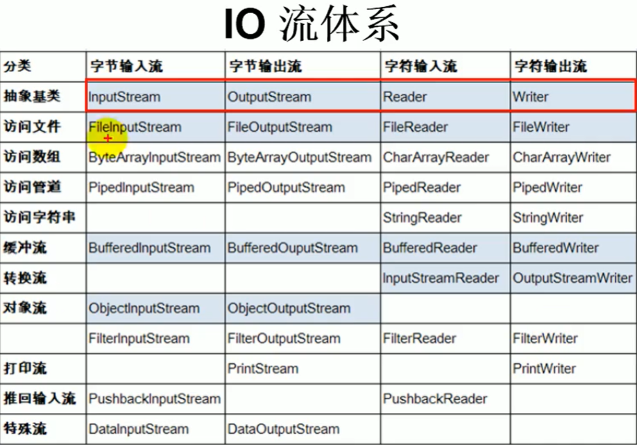
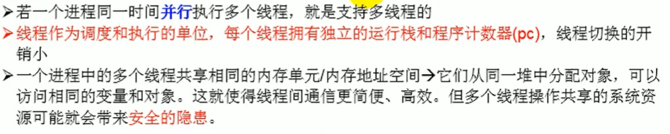
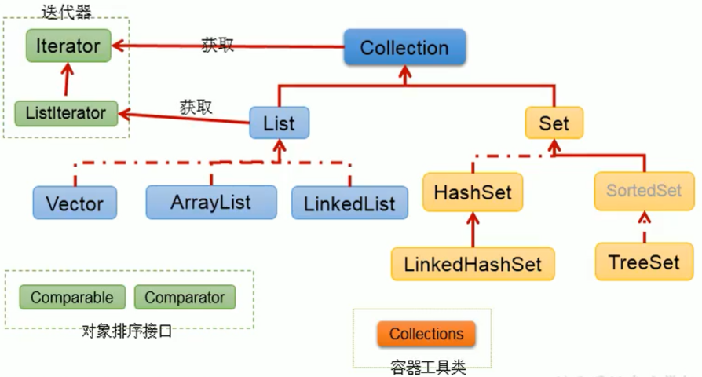
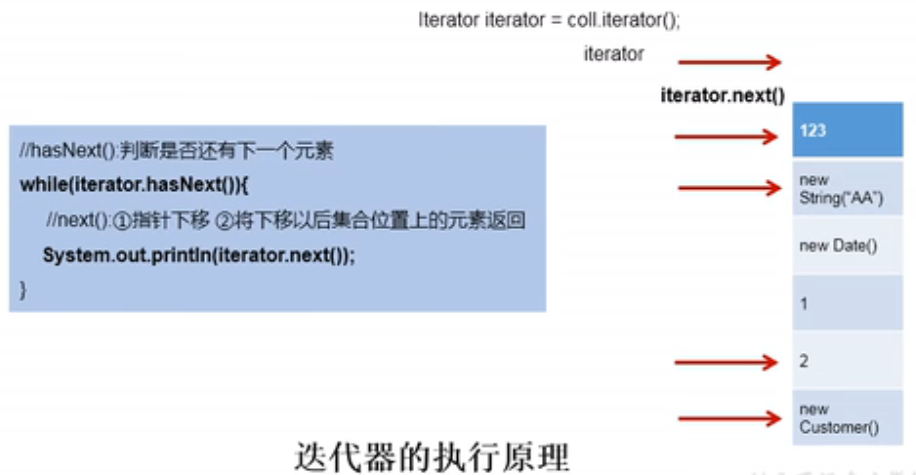
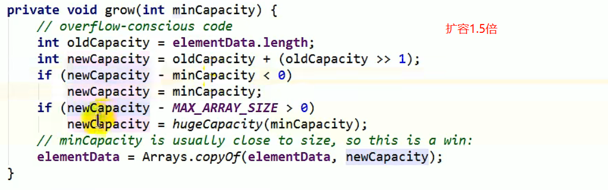
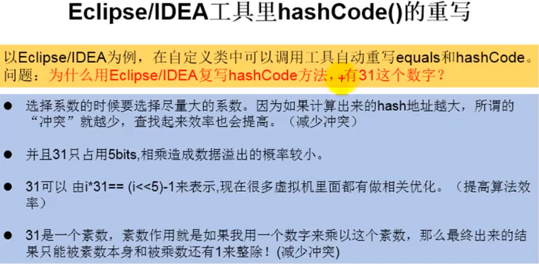
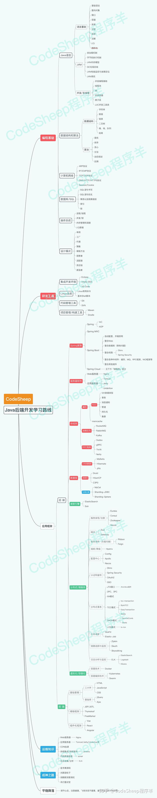

# 1. Java基础

## 1.1 语言基础

### 1.1.1 面向对象 OO（Object Oriented）

#### 一、什么是类、对象，如何理解面向对象编程？

**类**：具有相同属性和方法的对象的集合，它为属于该类的所有对象提供了统一的抽象描述，其内部包括属性和方法两个主要部分。

成员变量或方法限定词的含义：

* static：静态变量或方法。即使没有创建对象，也能调用这个变量或方法。(原话来自Thinking in Java)
  如果一个类中声明了静态变量，则该静态变量的存储空间不会随着对象创建而改变，即：N个对象共享这个静态变量。

  ```java
  public StaticClass {
      static int i = 1;
      static Integer I = 2;
  }
  StaticClass s1 = new StaticClass();
  StaticClass s2 = new StaticClass();
  //s1.i 和s2.i指向统一存储空间、s1.I和s2.I指向统一存储空间，因此st1.i = st2.i = 1,st1.I = st2.I = 2。
  
  ListNode.i++;
  System.out.println(node1.i); //输出2
  System.out.println(node2.i); //输出2
  node1.i++;
  System.out.println(node1.i); //输出3
  System.out.println(node2.i); //输出3
  
  ```

* final：

  final变量：使用final关键字定义的变量不可以改变，通常由final定义的变量为**编译时常量**。在java中定义全局不可修改的变量使用```public static final```修饰。

  final方法：不可被重写。防止子类修改父类方法定义和实现方式，同时定义为final的方法执行效率要高于非final方法。类中private方法隐式指定为final方法。

  final类：不可被继承。

  **final修饰的变量与方法是否线程安全？**

* this：（来自Thinking In Java）this关键字只能在方法内部使用，表示对“调用方法的那个对象”的引用。但是注意，在方法中调用同一个类中的方法没有必要使用this，例如：

  ```java
  public Test {
      void f1() {}
      void f2() {f1();}
  }
  ```

  何时使用this？在需要返回当前对象的引用时，例如：

  ```java
  public Test {
      int i = 0;
      Test fun() {
          i ++;
          return this;
      }
  }
  ```

* synchronized：解决并发问题常用解决方案（这里只做最初步的认识，JVM模块和多线程再详细学习）

  1）修饰代码块，即同步语句块，其作用的范围是大括号{}括起来的代码，作用的对象是调用这个代码块的对象。

  2）修饰普通方法，即同步方法，其作用的范围是整个方法，作用的对象是调用这个方法的对象。

  3）修饰静态方法，其作用的范围是整个静态方法，作用的对象是这个类的所有对象。

* abstract：修饰抽象方法，没有方法体。

* const、goto作为保留字，但是目前的java版本中没有用到。

**对象**：是类的实体，每个对象都有状态（属性）与行为（方法）。

**面向对象**：

* 面向对象的基本特性：继承、封装和多态。

  1）继承：子类对象拥有父类全部属性和方法。

  1. 单继承：一个父类可以有多个子类，但是一个子类只能有一个父类。（但支持多重继承）
  2. java.lang.Object是Java标准根类，任何一个类，如没有明确指定从其它类中继承，默认都是继承Object。（直接或间接）
  3. 子类无法访问父类中private或default方法和成员变量
  4. 子类可以重写父类的方法（非final方法）
  5. 向上转型：通过子类实例化父类，例如：

  ```java
  public A {
      public String s = "A";
      public void test() {}
      public void func() {
          System.out.println("Afunc");
      }
  }
  public B extends A{
      public String s = "B";
      public void test() {}
      public void func() {
          System.out.println("Bfunc");
          this.test(); //子类的test()
          super.test(); //父类的test()
      }
  }
  A a = new B(); // 向上转型
  a.func(); //输出Bfunc，向上转型访问子类的方法
  a.s; // A 向上转型访问父类的属性
  ```

  ​	6. 构造器：子类不继承构造器，但是如果父类构造器有参数，子类必须用super(params)显式调用父类构造器。

  2）封装：封装就是把普通的对象进行封装，对象的属性设为私有的，对外提供get和set方法，其他类只能通过get和set对对象属性值进行操作。

  3）多态：多态是建立在继承的基础上的，一个父类对象可以产生多个不同的子类对象，根据这些子类对象的不同可以具备不同的方法，也就是说表现出了不同的形态即多态。换句话说就是子类继承父类方法并重写，重写的方法必须和父类的方法返值相同，方法名相同，参数列表相同。

  ```java
  Parent p = new Child();
  ```

  使用多态方式调用方法时，首先检查基类（父类）中是否有该方法，如果没有，编译出错；如果有再去调用派生类（子类）的同名方法。

  **注意**：重载是发生在同一个类中的，方法名相同，参数不同，所以跟多态没有半毛钱关系！！！

### 1.1.2 字符串处理

### 1.1.4 I/O流


#### 1.1.4.1 IO流原理及分类

流（`Stream`），是一个抽象的概念，是指一连串的数据（字符或字节），是以先进先出的方式发送信息的通道。

一、IO是Input/Output的缩写，用于处理设备之间的数据传输。如读写文件、网络通讯等。

* 输入input：读取外部数据（磁盘、光盘等存储设备的数据）到程序（内存）中。
* 输出output：将程序（内存）数据输出到磁盘、光盘等存储设备中。

二、流的分类

* 按数据单位分：字节流（8bit），字符流（16bit）

* 按数据流的流向分：输入流，输出流。

* 按流的角色不同分：节点流，处理流

  节点流：可以从一个地方（节点）读数据或者可以向一个地方（地方）写数据的流，直接作用在数据源上。（文件节点流）

  处理流：是对一个已存在的流的连接或者封装，通过所封装的流的功能调用实现数据读写，如BufferReader。处理流的构造方法总是要带一个其他的流对象作为参数，一个流对象经过其他流的多次封装，称为流的连接。

三、流的体系结构

|   抽象基类   |     节点流      | 缓冲流（处理流的一种） |
| :----------: | :-------------: | :--------------------: |
| InputStream  | FileInputStream |   BufferInputStream    |
| OutputStream | FileInputStream |   BufferOuputStream    |
|    Reader    |   FileReader    |      BufferReader      |
|    Writer    |   FileWriter    |      BufferWriter      |



#### 1.1.4.2 各种流的使用

**使用流操作文件的步骤**：

1. 实例化File类对象，指明要操作的文件；
2. 提供具体流（通道）
3. 数据读入（写出）
4. 流的关闭

##### 一、字符流操作（Writer/Reader)

1. 读取文件的例子：

```java

    /**
     * 使用FileReader 的 read()方法。
     * 将txt文件的内容读入内存
     */
    public static void fileReaderWriterTest() throws IOException {
        FileReader fileReader = null;
        try {
            // File file = new File("test.txt");  // 相对于工程目录，根目录下如果没有会报错
            // 1.实例化File类对象，指明要操作的文件
            File file = new File("F:\\projects\\java-demo\\src\\Study\\test.txt");
            //2.提供具体流（字符流）（通道）
            fileReader = new FileReader(file);
            // 3.数据读入
            // read(): 返回读入的一个字符，如果达到文件末尾返回-1
            int data;
            StringBuilder stringBuilder = new StringBuilder();
            while ((data = fileReader.read()) != -1) {
                stringBuilder.append((char) data);
            }
            System.out.println(stringBuilder);
        } catch (IOException e) {
            e.printStackTrace();
        } finally {  //把close放在finally里面防止中途出现异常导致关闭流无法执行
            // 4.流的关闭 
            try {
                if(fileReader != null) {
                	fileReader.close();
                }
            } catch (IOException e) {
                e.printStackTrace();
            }
        }
    }
    /**
     * 对read()操作升级：使用read()的重载方法。
     */
    public static void fileReaderTest1() {
        // 1、实例化File对象
        FileReader fileReader = null;
        try {
            File file = new File("F:\\projects\\java-demo\\src\\Study\\test.txt");
            // 2、FileReader流的实例化
            fileReader = new FileReader(file);
            // 3、读入操作
            char[] chars = new char[5];
            int length;
            StringBuilder stringBuilder = new StringBuilder();
            while ((length = fileReader.read(chars)) != -1) {
                // stringBuilder.append(chars); //不能直接连接，因为如果某次length<5, 那么大于length的部分会是上一次读取的字符
                // 正确写法一
//                for (int i = 0; i < length; i++) {
//                    stringBuilder.append(chars[i]);
//                }
                // 正确写法二
                String str = new String(chars, 0, length);
                stringBuilder.append(str);
            }
            System.out.println(stringBuilder);
        } catch (IOException e) {
            e.printStackTrace();
        } finally {
            try {
                // 4、关闭流
                fileReader.close();
            } catch (IOException e) {
                e.printStackTrace();
            }
        }
    }
```

2. 写文件的例子

```java
    /**
     * 使用FileWriter把内存中的数据写入文件
     * 说明：
     * 1.输出操作，对应的文件可以不存在，
     *      如果不存在会自动创建，
     *      如果存在：FileWriter(file, false)覆盖原文件
     *              FileWriter(file, true) 追加
     */
    public static void fileWriterTest() {
        FileWriter fileWriter = null;
        try {
            // 1、实例化File对象
            File file = new File("F:\\projects\\java-demo\\src\\Study\\test.txt");
            // 2、提供流（实例化FileWriter对像）
            fileWriter = new FileWriter(file, true);
            // 3、写出的操作
            fileWriter.write("hello world!");
        } catch (IOException e) {
            e.printStackTrace();
        } finally {
            // 4、流资源的关闭
            try {
                fileWriter.close();
            } catch (IOException e) {
                e.printStackTrace();
            }
        }
    }
```

##### 二、字节流操作(FileInputStream/FileOutputStream)

不能使用使用字符流读取图片、视频等非文本二进制文件，使用字符流复制非文本二进制文件，文件会变大。

**问题：为什么不能使用字符流读取非文本二进制文件，文件又为什么会变大？**

对于这个问题先复习一下操作系统相关知识：

字节（byte[baɪt]）是存储数据的基本单位，位（bit[bɪt]）是存储数据的最小单位，1byte=8bit。计算机中整型数据都是以补码来存储的，正数的补码=原码，复数的补码=（除符号位外）原码取反+1，一个字节表示的范围是`-128~127`，在以字节形式存储的非文本二进制文件中，某个字节很有可能是一个负数，然而字符型变量以char类型表示，表示的范围是0~65535，使用FileReader读取字符就会将复数编程正数，比如将字节{-1}写入文件，使用read()的返回值65533，65533这个数使用一个字节根本存不下，所以使用FileReader读出来再用FileWriter写入文件，文件会变大。（解释的不够详细，需要详细了解系统编码）

对unicode的理解：unicode只是定义了一个庞大的、全球通用的**字符集**，从0开始对每个字符进行十进制唯一编号，十进制转换成16进制就是我们常说的码点，所有文字都用两个字节来表示（2^16)，至于如何存储，存储成什么样的字节流，取决于字符编码方案，推荐的unicode编码是UTF-8（变长1-4字节）和UTF-16。

这样来看的话，也算是能理解为什么java中Reader.read()方法返回的是个int而不是char，java中int类型占用4个字节（32bit），已经足够覆盖Unicode编码范围。

还需要了解文本文件和非文本文件是如何存储的。 

输入流读取文本文件会有什么后果？看下面的这个例子：

```java
/**
* 对于这种按字节读取，如果读一个字节存不下的字符，就可能出现乱码
* GBK编码一个汉字占2个字节，utf-8通常占三个字节，扩展B区以后的汉字占4个字节
* 比如文本文件中的内容是Hello 中国人，每五个字节一读，第一次读“Hello",第二次读” 中“加国字的第一个字节，第三次读国字的后两个字节以及人的三个字节，
* 这样读出来的数据国字将会乱码。输出是：Hello 中���人
*/
public static void testFileInputStream() {
    FileInputStream in = null;
    try {
        // 1、实例化File
        File file = new File("F:\\projects\\java-demo\\src\\Study\\test.txt");
        // 2、提供流
        in = new FileInputStream(file);
        // 3、读数据
        byte[] buffer = new byte[5];
        int len;
        StringBuilder stringBuilder = new StringBuilder();
        while ((len = in.read(buffer)) != -1) { //read如果没有参数默认返回一个字节的数据
            String str = new String(buffer, 0, len);
            stringBuilder.append(str);
        }
        System.out.println(stringBuilder);
    } catch (IOException e) {
        e.printStackTrace();
    } finally {
        // 4、关闭流
        try {
            if (in != null) {
                in.close();
            }
        } catch (IOException e) {
            e.printStackTrace();
        }
    }
}
```

使用字节流操作非文本二进制文件，例子：

```java

/**
* 复制图片
*/
public static void testFileIntputOutputStream() {
    FileInputStream fis = null;
    FileOutputStream fos = null; // 如果不存在，则创建；如果存在，则覆盖
    try {
        // 1、创建File对象
        File srcFile = new File("F:\\projects\\java-demo\\src\\Study\\iostream2xx.png");
        File desFile = new File("F:\\projects\\java-demo\\src\\Study\\iostreamnew.png");
        // 2、创建流
        if (!srcFile.exists()) return;
        fis = new FileInputStream(srcFile);
        fos = new FileOutputStream(desFile, false);
        // 3、读数据
        byte[] buffer = new byte[1024];
        int len;
        while ((len = fis.read(buffer)) != -1) {
            fos.write(buffer, 0, len);
        }
    } catch (IOException e) {
        e.printStackTrace();
    } finally {
        try {
            // 4、关闭流
            if (fis != null) {
                fis.close();
            }
            if (fos != null) {
                fos.close();
            }
        } catch (IOException e) {
            e.printStackTrace();
        }
    }
}
```

值得一说的是，对于复制或转储文件，使用字节流也是没有问题的，字节流只充当搬运通道的功能。

##### 三、缓冲流的使用（处理流）

1. 缓冲流：BufferedInputStream \ BufferedOutputStream \ BufferedReader \ BufferedWriter
2. 作用：提高流的读取、写入的速度。
   提速原理是什么？答：通过缓冲输入的方式提高读写效率，在BufferedInputStream中定义了DEFAULT_BUFFER_SIZE=8192这个常量，在BufferedReader中定义了这样一个常量，这个常量代表内部缓冲区的大小为8192byte，在创建buffer对象的时候，内存中会创建一个buf[8192]的byte数组（BufferReader中是char[]cb），使用buffer读取数据的时候，会先将数据写入buf这个数组中，输出的时候，并非读一次写一次，而是积累到缓冲数组满了之后一次性通过buf数组输出。每次输出之后都会有一次flush()操作，来刷新缓冲区。

字符缓冲流的使用：

```java
/**
* BufferedReader 和 BufferedWriter
*/
public static void testBuffered() {
    FileReader fileReader = null;
    FileWriter fileWriter = null;
    BufferedReader bufferedReader = null;
    BufferedWriter bufferedWriter = null;
    try {
        // 1、实例化File对象
        File srcFile = new File("F:\\projects\\java-demo\\src\\Study\\test.txt");
        File desFile = new File("F:\\projects\\java-demo\\src\\Study\\test1.txt");
        // 2、创建节点流（字符流）
        fileReader = new FileReader(srcFile);
        fileWriter = new FileWriter(desFile);
        // 3、创建处理流（缓冲字符流）
        bufferedReader = new BufferedReader(fileReader);
        bufferedWriter = new BufferedWriter(fileWriter);
        // 4、读数据，写数据（文本文件使用char）
        char[] buffer = new char[1024];
        int len;
        while ((len = bufferedReader.read(buffer)) != -1) {
            bufferedWriter.write(buffer, 0, len);
        }
    } catch (IOException e) {
        e.printStackTrace();
    } finally {
        try {
            //关闭流：先关外层，再关内层
            bufferedReader.close();
            bufferedWriter.close();
            fileReader.close();
            fileWriter.close();
        } catch (IOException e) {
            e.printStackTrace();
        }
    }
}
```

字节缓冲流的使用：

```java
/**
* BufferedInputStream 和 BufferedOutputStream
*/
public static void testBufferedStream() {
    FileInputStream fis = null;
    FileOutputStream fos = null;
    BufferedInputStream bfis = null;
    BufferedOutputStream bfos = null;
    try {
        // 1、实例化File对象
        File srcFile = new File("F:\\projects\\java-demo\\src\\Study\\iostreamnew.png");
        File desFile = new File("F:\\projects\\java-demo\\src\\Study\\iostreamnew1.png");
        // 2、创建节点流（字节流）
        fis = new FileInputStream(srcFile);
        fos = new FileOutputStream(desFile);
        // 3、创建处理流（缓冲字节流）
        bfis = new BufferedInputStream(fis);
        bfos = new BufferedOutputStream(fos);
        // 4、读数据，写数据（非文本文件使用byte）
        byte[] buffer = new byte[1024];
        int len;
        while ((len = bfis.read(buffer)) != -1) {
            bfos.write(buffer, 0, len);
        }
    } catch (IOException e) {
        e.printStackTrace();
    } finally {
        try {
            //关闭流：先关外层，再关内层
            bfis.close();
            bfos.close();
            //说明：关闭外层流的同时，内层流也会自动进行关闭，内层流的关闭可以省略。
            fis.close();
            fos.close();
        } catch (IOException e) {
            e.printStackTrace();
        }
    }
}
```

文件加密、解密

```java
/**
* 加密
*/
public static void fileEncrypt() {
    FileInputStream fis = null;
    FileOutputStream fos = null;
    BufferedInputStream bfis = null;
    BufferedOutputStream bfos = null;
    try {
        // 1、实例化File对象
        File srcFile = new File("F:\\projects\\java-demo\\src\\Study\\iostreamnew.png");
        File desFile = new File("F:\\projects\\java-demo\\src\\Study\\iostreamnew1.png");
        // 2、创建节点流（字符流）
        fis = new FileInputStream(srcFile);
        fos = new FileOutputStream(desFile);
        // 3、创建处理流（缓冲字符流）
        bfis = new BufferedInputStream(fis);
        bfos = new BufferedOutputStream(fos);
        // 4、读数据，写数据（非文本文件使用byte）
        byte[] buffer = new byte[1024];
        int len;
        while ((len = bfis.read(buffer)) != -1) {
            // 加密操作：改变字节数组中每个字节的数据
            for (int i = 0; i < len; i++) {
                buffer[i] = (byte) (buffer[i] ^ 5);
            }
            bfos.write(buffer, 0, len);
        }
    } catch (IOException e) {
        e.printStackTrace();
    } finally {
        try {
            //关闭流：先关外层，再关内层
            bfis.close();
            bfos.close();
            fis.close();
            fos.close();
        } catch (IOException e) {
            e.printStackTrace();
        }
    }
}

/**
* 解密
*/
public static void fileDecrypt() {
    FileInputStream fis = null;
    FileOutputStream fos = null;
    BufferedInputStream bfis = null;
    BufferedOutputStream bfos = null;
    try {
        // 1、实例化File对象
        File srcFile = new File("F:\\projects\\java-demo\\src\\Study\\iostreamnew1.png");
        File desFile = new File("F:\\projects\\java-demo\\src\\Study\\iostreamnew2.png");
        // 2、创建节点流（字符流）
        fis = new FileInputStream(srcFile);
        fos = new FileOutputStream(desFile);
        // 3、创建处理流（缓冲字符流）
        bfis = new BufferedInputStream(fis);
        bfos = new BufferedOutputStream(fos);
        // 4、读数据，写数据（非文本文件使用byte）
        byte[] buffer = new byte[1024];
        int len;
        while ((len = bfis.read(buffer)) != -1) {
            // 解密操作：如何加密即如何解密，两个数相同异或为0，任何一个数与0异或都得它本身
            for (int i = 0; i < len; i++) {
                buffer[i] = (byte) (buffer[i] ^ 5);
            }
            bfos.write(buffer, 0, len);
        }
    } catch (IOException e) {
        e.printStackTrace();
    } finally {
        try {
            //关闭流：先关外层，再关内层
            bfis.close();
            bfos.close();
            fis.close();
            fos.close();
        } catch (IOException e) {
            e.printStackTrace();
        }
    }
}
```

##### 四、转换流（字符流、处理流）

项目中一般在读取文本文件内容的时候会用到，转换流其实就是解码与编码的过程，

1. 转换流：属于字符流

   InputStreamReader：将一个字节的输入流转换为字符的输入流（解码）

   OutputStreamWriter：将一个字符的输出流转换为字节的输出流（编码）

   方便记：内存中为字符

2. 作用：提供字节流与字符流之间的转换

3. 解码：字节、字节数组 --->字符数组、字符串

   编码：字符数组、字符串 ----> 字节、字节数组

4. 字符集：utf-8，或gbk

InputStreamReader使用的例子：

```java

/**
* InputStreamReader使用，实现字节输入流到字符输入流的转换
*/
public static void testInputStreamReader() {
    InputStreamReader isr = null;
    try {
        FileInputStream fis = new FileInputStream("F:\\projects\\java-demo\\src\\Study\\test.txt");
        //残数2指明了字符集，具体根据文件保存时使用的字符集
        isr = new InputStreamReader(fis, "UTF-8");
        char[] cb = new char[1024];
        int len;
        StringBuilder stringBuilder = new StringBuilder();
        while ((len = isr.read(cb)) != -1) {
            String str = new String(cb, 0, len);
            stringBuilder.append(str);
        }
        System.out.println(stringBuilder);
    } catch (IOException e) {
        e.printStackTrace();
    } finally {
        try {
            isr.close();
        } catch (IOException e) {
            e.printStackTrace();
        }
    }
}
```

OutputStreamWriter：

```java
/**
* 综合使用InputStreamReader和OutputStreamWriter，
* 实现文本文件格式转换,输入utf-8，输出gbk
*/
public static void testStreamReaderWriter() {
    InputStreamReader isr = null;
    OutputStreamWriter osr = null;
    try {
        FileInputStream fis = new FileInputStream("F:\\projects\\java-demo\\src\\Study\\test.txt");
        FileOutputStream fos = new FileOutputStream("F:\\projects\\java-demo\\src\\Study\\testgbk.txt");
        //残数2指明了字符集，具体根据文件保存时使用的字符集
        isr = new InputStreamReader(fis, StandardCharsets.UTF_8);
        osr = new OutputStreamWriter(fos, "GBK");
        char[] cb = new char[1024];
        int len;
        StringBuilder stringBuilder = new StringBuilder();
        while ((len = isr.read(cb)) != -1) {
            osr.write(cb, 0, len);
        }
    } catch (IOException e) {
        e.printStackTrace();
    } finally {
        try {
            isr.close();
            osr.close();
        } catch (IOException e) {
            e.printStackTrace();
        }
    }
}
```

##### 五、标准输入、输出流

1. Scanner

输入字符串

```java
Scanner scanner = new Scanner(System.in);
while (scanner.hasNextLine()) {
    String str = scanner.nextLine().toUpperCase(Locale.ROOT);
    System.out.println(str);
}
```

**next() 与 nextLine() 区别**

next():

- 一定要读取到有效字符后才可以结束输入。
- 对输入有效字符之前遇到的空白，next() 方法会自动将其去掉。
- 只有输入有效字符后才将其后面输入的空白作为分隔符或者结束符。
- next()不能得到带有空格的字符串。

nextLine()：

- 以Enter为结束符,也就是说 nextLine()方法返回的是输入回车之前的所有字符。
- 可以获得空白。

输入多个数字：

```java
Scanner scan = new Scanner(System.in);
int[] arr = new int[5];
int index = 0;
while (scan.hasNextInt() && index < 5) {
    arr[index] = scan.nextInt();
}
System.out.println(arr);
```

2. 标准输入输出操作

```java
/**
     * 1、标准输入\输出流
     *     1.System.in：标准输入流，类型是InputStream，默认从键盘输入，
     *     2.System.out：标准输出流,类型是PrintStream，默认从控制台输出
     * 2、System类的setIn(InputStream is) / setOut(PrintStream ps) 方式重新指定输入和输出的流
     * 3、练习：从键盘输入字符串，要求将读取到的整行字符串转换成大写输出，然后继续进行输入操作，
     * 直到输入”e“或者”exit“时退出程序
     */
public static void systemInOut() {
    //方法一：使用Scanner实现，调用next()返回一个字符串。
    Scanner scanner = new Scanner(System.in);
    while (scanner.hasNextLine()) {
        String str = scanner.nextLine();
        if (str.equals("e") || str.equals("exit")) {
            break;
        }
        System.out.println(str.toUpperCase());
    }
    //方法二：使用System.in实现,System.in的类型是InputStream，我们可以使用转换流将字节流转换成字符流
    InputStreamReader isr = null;
    BufferedReader bufferedReader = null;
    try {
        isr = new InputStreamReader(System.in);
        bufferedReader = new BufferedReader(isr);
        String lineStr;
        while ((lineStr = bufferedReader.readLine()) != null) {
            if ("e".equals(lineStr) || "exit".equals(lineStr)) {
                break;
            }
            System.out.println(lineStr.toUpperCase());
        }
    } catch (IOException e) {
        e.printStackTrace();
    } finally {
        try {
            bufferedReader.close();
            isr.close();
        } catch (IOException e) {
            e.printStackTrace();
        }

    }
}
```

##### 六、打印流

```java
public static void main(String arg[]) throws Exception{
    PrintStream ps = null ;        // 声明打印流对象
    // 如果现在是使用FileOuputStream实例化，意味着所有的输出是向文件之中
    ps = new PrintStream(new FileOutputStream(new File("d:" + File.separator + "test.txt"))) ;
    ps.print("hello ") ;
    ps.println("world!!!") ;
    ps.print("1 + 1 = " + 2) ;
    ps.close() ;
}
```

##### 七、数据流

数据流是缓冲流的包装类，缓冲流又是FileInputstream的包装类，此类里面有各种写入字符串、基本数据类型数据的方法

```java
public static void main(String[] args) throws IOException {
    DataOutputStream ds=new DataOutputStream(new FileOutputStream("F:/tss1.txt"));
    ds.writeInt(34);
    ds.writeDouble(12.3);
    ds.writeChars("张三");
    ds.close();
    DataInputStream dis=new DataInputStream(new FileInputStream("F:/tss1.txt"));
    System.out.println(dis.readInt());
    System.out.println(dis.readDouble());
    System.out.println((dis.readChar())+""+dis.readChar());
}
```

##### 八、对象流(处理流-序列化和反序列化)

ObjectInputStream和ObjectOutputStream：用于存储和读取基本数据类型数据或对象的处理流。它的强大之处在于可以把Java中的对象写入到数据源中，也能把对象从数据源中还原回来。

* 序列化：用ObjectInputStream类**保存**基本数据类型或对象的机制
* 反序列化：用ObjectOutputStream类读取基本数据类型或对象的机制
* 对象流不能序列化**static**和**transient**修饰的成员变量

**对象的序列化**(借着对象流浅浅了解一波)：

* 对象的序列化机制允许把内存中的Java对象转换成平台无关的二进制流，从而允许把这种二进制流持久地保存在磁盘上，或通过网络将这种二进制流传输到另一个网络节点。当其他程序获取了这种二进制流就可以恢复成原来的Java对象。

* 序列化的好处在于可以将任何实现了Serializable接口的对象转化成字节数据，使其在保存和传输时可以被还原。

* 序列化是RMI（Remote Method Invoke -远程方法调用）过程的参数和返回值都必须实现的机制，而RMI是JavaEE的基础。因此序列化机制是JavaEE平台的基础。

* 如果需要让某个对象支持序列化机制，则必须让对象所属的类及其属性是可序列化的，为了让某个类是可序列化的，该类必须实现如下两个接口之一，否则会抛出**NotSerializableException**异常

  -> **Serializable**

  -> **Externalizable**

对象流操作：序列化、反序列化以及让类支持序列化

* 凡是实现Serializable接口的类都有一个表示序列化版本标识符的静态变量：
  * public static final long serialVersionUID = 13231231L; //值可以任意
  * SerialVersionUID用来表明类的不同版本间的兼容性。简言之，其目的是以序列化对象进行版本控制，有关个版本反序列化时是否兼容。
  * 如果类没有显示定义这个静态变量，它的值时Java运行时环境根据类的内部细节自动生成的（如何生成的？）。若类的实例变量做了修改，serialVersionUID可能发生变化。故建议显示声明。
* 简单来说，Java的序列化机制是通过在运行时判断类的serialVersionUID来验证版本一致性。在进行反序列化时，JVM会把传来的字节流中的SerialVersionUID与本地相应实体类的serialVersionUID进行比较，如果相同就认为是一致的，可以进行反序列化，否则就会出现序列化版本不一致的异常。(InvalidCastException)

```java

/**
 * 对象流的使用
 */
public class ObjectInputOutputStream {
    /**
     * ObjectOutputStream 对象输出流的使用
     * 序列化过程：将内存中的Java对象保存到磁盘中或通过网络传输出去
     */
    @Test
    public void testObjectOutputStream() {
        ObjectOutputStream objOs = null;
        try {
            File file = new File("F:\\projects\\java-demo\\src\\Study\\testObjStream");
            FileOutputStream fos = new FileOutputStream(file);
            objOs = new ObjectOutputStream(fos);
            objOs.writeObject(new Person("王明", 23));
            objOs.flush(); //刷新操作
        } catch (IOException e) {
            e.printStackTrace();
        } finally {
            try {
                if (objOs != null) {
                    objOs.close();
                }
            } catch (IOException e) {
                e.printStackTrace();
            }
        }
    }

    /**
     * 反序列化：将磁盘文件中的对象还原为内存中的一个java对象
     * 使用ObjectInputStream来实现
     */
    @Test
    public void testObjectInputStream() {
        ObjectInputStream objIs = null;
        try {
            File file = new File("F:\\projects\\java-demo\\src\\Study\\testObjStream");
            FileInputStream fis = new FileInputStream(file);
            objIs = new ObjectInputStream(fis);
            Person str = (Person) objIs.readObject();
            System.out.println(str);
        } catch (IOException e) {
            e.printStackTrace();
        } catch (ClassNotFoundException e) {
            e.printStackTrace();
        } finally {
            try {
                if (objIs != null) {
                    objIs.close();
                }
            } catch (IOException e) {
                e.printStackTrace();
            }
        }
    }

}
/**
 * Person 需要满足如下要求方可序列化：
 * 1、需要实现接口：Serializable
 * 2、当前类提供一个全局常量：serialVersionUID
 * 3、除了当前Person类需要实现Serializable接口之外，还需必须保证其内部所有属性也必须是可序列化的。（默认情况下基本数据类型及其对象可序列化）
 */
class Person implements Serializable {

    public static final long serialVersionUID = 13231231L;

    private String name;
    private Integer age;

    Person(String name, Integer age) {
        name = name;
        age = age;
    }
}
```

##### 九、随机存取文件流（了解）

RandomAccessFile直接继承于java.lang.Object类，实现了DataInput和DataOutput接口，它既可以作为一个输入流，又可以作为一个输出流。

```java
public class RandomAccessFileTest {
    @Test
    public void test1() {
        RandomAccessFile randomAccessFile = null;
        RandomAccessFile randomAccessFile1 = null;
        try {
            // 第二个参数是mode：r(只读、文件已存在),rw（读写）,rwd（读写，同步内容更新）,rws（读写，同步内容和元数据更新
            randomAccessFile = new RandomAccessFile(new File("F:\\projects\\java-demo\\src\\Study\\test.txt"), "r");
            randomAccessFile1 = new RandomAccessFile(new File("F:\\projects\\java-demo\\src\\Study\\test1.txt"), "rw");
            byte[] bytes = new byte[1024];
            int len;
            while ((len = randomAccessFile.read(bytes)) != -1) {
                randomAccessFile1.write(bytes, 0, len); // 对已经存在的内容进行覆盖比如原来的内容abcd，写入的内容是aaa，写入后内容变成aaad
            }
        } catch (IOException e) {
            e.printStackTrace();
        } finally {
            try {
                if (randomAccessFile != null) {
                    randomAccessFile.close();
                }
                if (randomAccessFile1 != null) {
                    randomAccessFile1.close();
                }
            } catch (IOException e) {
                e.printStackTrace();
            }
        }
    }
}
```

##### 十、NIO.2中Path、Paths、Files类的使用

* Java NIO（New IO，Non-Blocking IO(无阻塞)）是从Java1.4开始引入的，它与原来的IO有同样的作用和目的，但是使用的方式完全不同，NIO支持面向缓冲区的（IO是面向流的）、基于通道的IO操作，NIO将以更高效的方式进行文件的读写操作。
* JavaAPI中提供了两套NIO，一套是针对标准输入输出NIO，另一套就是网络编程NIO

### 1.1.5 多线程

#### 1.1.5.1 基本概念：程序、进程、线程

* 程序（program）：为了完成特定任务、用某种语言编写的一组指令的集合。即一段静态的代码，静态对象。
* 进程（process）：是程序的一次执行过程，或是正在运行的一个程序，是一个动态过程：有它自身的产生、存在和消亡的过程。——生命周期
* 线程（Thread）：进程可以进一步细化为线程，是一个程序内部的一条执行路径




### 1.1.6 容器

#### 1.1.6.1  Collectoin接口

##### 一、单列集合框架结构

|------Collection接口：单列集合，用来存储一个一个的对象

​		|------List接口：存储有序的、可重复的数据。

​				|------ArrayList：作为List的主要实现类；线程不安全，效率高；底层使用Object[] elementData存储。

​				|------LinkedList：对于频繁的插入、删除操作，使用此类效率比ArrayList高；底层使用双向链表存储；

​				|------Vecter：作为List古老的实现类；线程安全，效率低；底层用Object[] elementData存储。

​		|------Set接口：存储无序、不可重复的数据

​				|------HashSet：作为Set接口的主要实现类；线程不安全的；可以存储null值

​						|------LinkedHashSet：作为HashSet的子类；遍历其内部属性时，可以按照添加的顺序遍历。

​															在添加数据的同时，每个数据还维护了两个引用，记录了此数据前一个树蕨和后一个数据。

​				|------TreeSet：可以按照添加对象的指定属性，进行排序



##### 二、Collection常用接口

contains(obj)：需要obj对象所属的类重写equals方法

containsAll(collection)

remove(obj))：需要obj对象所属的类重写equals方法

removeAll(collection)

retainAll(collection)：求与collection的交集

equals(collection)：两个集合的元素和顺序是否一样，都一样返回true

hashCode()：返回哈希值

toArray()：集合转换成数组

iterater()：返回Iterater()接口实例，用于遍历集合元素。放在

##### 三、集合元素的遍历

###### 1. 使用Iterater遍历

```java
public void testIterator() {
    Collection collection = new ArrayList();
    collection.add(123);
    collection.add("AA");
    collection.add(new Date());
    collection.add(1);
    collection.add(2);
    collection.add(new Customer());

    Iterator<Object> iterator = collection.iterator();
    while (iterator.hasNext()) {
        System.out.println(iterator.next());
    }
}
```



迭代器执行原理：①hasNext()判断是否还有下一个元素；②next()，**指针**下移；③将下以后的集合位置上的元素位置返回。

**迭代器Iterator的remove()方法**

```java
public void testIteratorRemove() {
    Collection collection = new ArrayList();
    collection.add(123);
    collection.add("AA");
    collection.add(new Date());
    collection.add(1);
    collection.add(2);
    Iterator<Object> iterator = collection.iterator();
    while (iterator.hasNext()) {
        Object obj = iterator.next();
        if (obj.equals(1)) {
            iterator.remove();
        }
    }
}
```

如果还未掉用next()或者在上一次调用next()方法之后已经调用了remove方法。在调用remove都会报IllegalStateException

###### 2. foreach

```java
public void testForeach() {
    Collection collection = new ArrayList();
    collection.add(123);
    collection.add("AA");
    collection.add(new Date());
    collection.add(1);
    collection.add(2);
    // 集合元素类型 局部变量 : 集合对象
    // 内部还是用了迭代器
    for (Object obj : collection) {
        System.out.println(obj);
    }
}
```

##### 四、※ Collection子接口之一：List接口

###### 1. ArrayList源码分析

* jdk7版本下：

ArrayList list = new ArrayList(); //空参构造器，底层创建长度为10的Object[] elementData数组

list.add(value); //elementData[0] = new Object(value);

add......

list.add(11); //如果此次的添加导致底层elementData数组容量不够，则扩容。默认情况下，扩容为原来的容量的1.5倍，同时需要将原有数组中的数据复制到新的数组中。

**结论**：建议开发中使用带参构造器：ArrayList list =new ArrayList(int capacity);



* jdk8版本下：

ArrayList list = new ArrayList();// 底层Object[] elementData初始化为{}，并没有创建长度为10的数组。

list.add(value);// 第一次调用add()时，底层才创建了长度为10的数组，并将数据value天骄到elementData[0]

add......

后续添加和扩容操作与jdk7无异。

小结：jdk7中的arraylist创建类似于单例的饿汉式，而jdk8中arraylist的对象的创建类似于单例的懒汉式，延迟了数组的创建，节省了内存。

###### 2. LinkedList源码分析

LInkedList list = new LinkedList(); //内部声明了Node类型的first和last属性，默认值为null

list.add(123); //将123封装到Node中创建Node对象

其中Node定义如下，体现了LinkedList的双向链表的说法

```java
private static class Node<E> {
    E item;
    Node<E> next;
    Node<E> prev;

    Node(Node<E> prev, E element, Node<E> next) {
        this.item = element;
        this.next = next;
        this.prev = prev;
    }
}
```

###### 3. Vector源码分析

jdk7hejdk8中通过Vector()构造器创建对象时，底层都创建了长度为10的数组，在扩容方面，默认扩容为原来的数组长度的2倍。

###### 4. 常用方法

增：add(Object obj)
删：remove(int index)  / remove(Object obj)
改：set(int index, Object obj)
查：get(int index)
插：add(int index, Object obj)
长度：size()
遍历：①Iterator 迭代器方式
			②foreach
			③普通for

##### 五、Collection子接口之二：Set接口

* Set接口中没有额外定义新方法，都是Collection中声明过的方法：

* 要求：向Set中添加元素，其所在的类一定要重写hashCode()和equals()方法。重写hashCode()和equals()尽可能保持一致性：相等的对象必须具有相等的散列码。

  重写两个方法的小技巧：对象中用作equals()方法比较Field，都应该用来计算hashCode值

###### 1.存储无序的、不可重复的（以HashSet说明）

* 无序性：不等于随机性。存储的数据在底层数组中并非按照数组索引的顺序添加的，而是根据数据的哈希值决定的。
* 不可重复性：保证添加的元素按照equals()方法判断时，不能返回true。即相同的元素只能添加一个。

###### 2. 添加元素的过程（以HashSet为例）

* 向HashSet中添加元素a，首先调用元素a所在类的hashCode()方法，计算元素a的哈希值，此哈希值接着通过某种算法计算在HashSet底层数组中的存放位置（即为索引位置），然后判断数组此位置上是否已有元素：

  * 如果此位置上没有其他元素，则元素a添加成功；——>①

  * 如果此位置上有其他元素b（或以链表形式存在的多个元素），则比较元素a和元素b的hash值：
    * 如果hash值不同，则，元素a添加成功；——>②
    * 如果hash值相同，进而需要调用元素a所在的类的equals()方法：
      * equals()返回true，元素a添加失败；
      * equals()返回false，则元素a添加成功。——>②

对于添加成功的情况②和情况③而言：元素a与已经存在指定索引位置上数据以链表的方式存储。
jdk 7：元素a放在数组中，指向原来的元素。（头插法，反客为主）
jdk 8：原来的元素在数组中，指向元素a。（尾插法，先来后到）

**HashSet底层：数组 + 链表**



###### 3. LinkedHashSet

作为HashSet的子类，在添加数据的同时，每个数据还维护了两个引用，记录了此数据前一个树蕨和后一个数据。

###### 4. TreeSet 

* 向TreeSet中添加的数据，要求是相同类的对象
* 两种排序方式：自然排序(实现Comparable接口) 和 定制排序
* 自然排序中，比较两个对象是否相同的标准为：compareTo()返回0，不再是equals()。

```java

public class SetTest {
    // 自然排序 实现Comparable接口
    @Test
    public void treeSetTest() {
        TreeSet<User> objects = new TreeSet<>();
        objects.add(new User("a", 2));
        objects.add(new User("b", 3));
        objects.add(new User("c", 4));
        objects.add(new User("d", 5));
        Iterator<User> userIterator = objects.iterator();
        while (userIterator.hasNext()) {
            System.out.println(userIterator.next());
        }
    }
    //定制排序
    @Test
    public void test1() {
        Comparator comparable = new Comparator() {
            // 按照年龄从小到大排序
            @Override
            public int compare(Object o1, Object o2) {
                if (o1 instanceof User && o2 instanceof User) {
                    User u1 = (User) o1;
                    User u2 = (User) o2;
                    return Integer.compare(((User) o1).age, ((User) o2).age);
                }else {
                    throw new RuntimeException("数据类型不匹配");
                }
            }
        };

        TreeSet<User> objects = new TreeSet<>(comparable);
        objects.add(new User("c", 4));
        objects.add(new User("d", 5));
        objects.add(new User("a", 2));
        objects.add(new User("b", 3));
        objects.add(new User("e", 3)); //不会添加进去
        Iterator<User> userIterator = objects.iterator();
        while (userIterator.hasNext()) {
            System.out.println(userIterator.next());
        }
    }
}

class User implements Comparable {
    String username;
    Integer age;

    public User(String username, Integer age) {
        this.username = username;
        this.age = age;
    }

    //按姓名从小到大排
    @Override
    public int compareTo(Object o) {
        if (o instanceof User) {
            User user = (User) o;
            return this.username.compareTo(username);
        }else {
            System.out.println("输入的类型不匹配");
        }
        return 0;
    }

    @Override
    public String toString() {
        return "User{" +
                "username='" + username + '\'' +
                ", age=" + age +
                '}';
    }
}
```


##### 面试题

###### 1.※  面试题：ArrayList、LinkedList、Vector三者异同？

同：三个类都实现了List接口，存储数据的特点相同：存储有序、可重复的数据。

异： ArrayList：作为List的主要实现类；线程不安全，效率高；底层使用Object[] elementData存储。

​		LinkedList：对于频繁的插入、删除操作，使用此类效率比ArrayList高；底层使用双向链表存储；

​	 	Vector：作为List古老的实现类；线程安全，效率低；底层用Object[] elementData存储。

###### 2. list.remove()考察

```java
public void testLinkedList() {
    List<Integer> list = new ArrayList<>();
    list.add(1);
    list.add(2);
    list.add(3);
    updateList(list);
    System.out.println(list);
}
public void updateList(List<Integer> list) {
    list.remove(2); // 2为索引 移除元素3
    //list.remove(new Integer(2)); // 2为对象，移除元素2
}
```

###### 3. set代码题

```java
// Persons重写了hashCode和equals
public class Testing{
    @Test
    public void test() {
        HashSet set = new HashSet();
        Persons p1 = new Persons(1001, "AA");
        Persons p2 = new Persons(1002, "BB");

        set.add(p1);
        set.add(p2);
        System.out.println(set); //1001 AA 1002 BB
        p1.username = "CC";
        set.remove(p1);  //根据1001和CC算出hash值，找不到AA添加时的位置，移除失败
        System.out.println(set);//1001 CC 1002 BB
        set.add(new Persons(1001, "CC")); // 根据1001和CC算出hash值，与AA添加时不同，添加成功
        System.out.println(set);//1001 CC, 1002 BB, 1001 CC
        set.add(new Persons(1001, "AA")); //与最开始的AAhash值相同，但是AA变成了CC，equals返回false
        System.out.println(set); // 1001 CC, 1002 BB, 1001 CC，1001 AA
    }
}
/**

*/
class Persons {
    String username;
    Integer age;

    public Persons( Integer age, String username) {
        this.username = username;
        this.age = age;
    }

    @Override
    public String toString() {
        return "User{" +
                "username='" + username + '\'' +
                ", age=" + age +
                '}';
    }
    @Override
    public boolean equals(Object o) {
        if (this == o) return true;
        if (o == null || getClass() != o.getClass()) return false;

        Persons user = (Persons) o;

        if (username != null ? !username.equals(user.username) : user.username != null) return false;
        return age != null ? age.equals(user.age) : user.age == null;
    }

    @Override
    public int hashCode() {
        int result = username != null ? username.hashCode() : 0;
        result = 31 * result + (age != null ? age.hashCode() : 0);
        return result;
    }
}
```

#### 1.1.6.2 Map接口

* Map：双列数据，存储key-value对数据
  * HashMap：作为主要的实现类；线程不安全的，效率高；可以存储null的key和value
    * LinkedHashMap：保证在遍历map元素时，可以按照添加的顺序实现遍历。原因：在原有的HashMap底层结构基础上，添加了一对指针，指向前一个和都一个元素，对于频繁的遍历操作，此类执行效率高于HashMap
  * TreeMap：保证添加的key—value对进行排序，实现排序遍历。此时考虑key的自然排序或定制排序
    * 底层使用红黑树
  * Hashtable：作为古老的实现类；线程安全的，效率低；不能存储null的key和value
    * Properties：常用来处理配置文件。key和value都是String类型。

HashMap的底层：数组+链表（jdk7-）||  数组+链表+红黑树（jdk8+）

##### 1.1.6.2.1 HashMap底层实现原理

###### 1. Map结构的理解

* Map中的key：无序的、不可重复，使用Set存储所有key（以HashMap为例，key所在的类，需要重写equals和hashCode() ，一般情况下，很少用自定义类作为key，Integer和String作为key的情况比较多，Integer和String类都重写了equals和hashCode方法）
* Map中的value：无序、可重复，使用Collection存储所有的value，value所在的类需要重写equals
* 一个key-value构成了一个Entry对象。
* Map中的entry：无序、不可重复的，使用Set存储所有的entry

###### 2. HashMap的底层实现原理

* jdk 7u8中：底层采用Entry[] table数组存储数据，entry是HashMap的内部类，

  ```java
  static class Entry<K,V> implements Map.Entry<K,V> {
      final K key;
      V value;
      Entry<K,V> next;
      int hash;
  }
  ```

  * HashMap map = new HashMap(int initialCapacity, float loadFactor)：在实例化时，首先调用无参构造函数，在无参构造函数中调用重载的构造函数HashMap(int initialCapacity, int loadFactor)，第一个参数是默认初始容量 ，默认值为16=1<<4，第二个参数为负载因子，默认值为0.75

    ```java
    // 默认初始容量 - 必须是 2 的幂
    static final int DEFAULT_INITIAL_CAPACITY = 1 << 4;
    //构造函数中未指定时使用的负载因子
    static final float DEFAULT_LOAD_FACTOR = 0.75f;
    // 最大容量，如果一个更高的值由任何一个带参数的构造函数隐式指定时使用。必须是 2 <= 1<<30 的幂。
    static final int MAXIMUM_CAPACITY = 1 << 30;
    //构造一个具有默认初始容量 (16) 和默认加载因子 (0.75) 的空HashMap 
    public HashMap() {
        this(DEFAULT_INITIAL_CAPACITY, DEFAULT_LOAD_FACTOR);
    }
    //构造一个具有指定初始容量和负载因子的空 HashMap。 
    //@param initialCapacity 初始容量
    //@param loadFactor 负载因子
    public HashMap(int initialCapacity, float loadFactor) {
        if (initialCapacity < 0)
            throw new IllegalArgumentException("Illegal initial capacity: " + initialCapacity);
        if (initialCapacity > MAXIMUM_CAPACITY)
            initialCapacity = MAXIMUM_CAPACITY;
        if (loadFactor <= 0 || Float.isNaN(loadFactor))
            throw new IllegalArgumentException("Illegal load factor: " + loadFactor);
        this.loadFactor = loadFactor;
        threshold = initialCapacity; // 扩容临界点值
        init();
    }
    // 初始化方法，在HashMap中没有实现
    void init() {}
    ```

  * map.put（key1，value1) ：首先：如果首次调用put方法添加数据，先调用inflateTable(int toSize)方法在底层创建长度为16的一维数组Entry[] table
    调用key1所在类的hashCode方法计算key1的哈希值，此哈希值经过某种算法计算以后，得到Entry数组中的存放位置i，

    * 如果此位置上的数据为空，此时key1-value1添加成功.——>情况①
    * 如果此位置上的数据不为空，意味着此位置存在一个或多个数据（以链表的形式存在），比较key1和已经存在的一个或多个数据的哈希值：
      * 如果key1的哈希值与已经存在的数据的hash值都不相同，此时key1-value1添加成功。——>情况②
      * 如果key1的hash值和已经存在的某一个数据（key2-value2）的hash值相同，继续比较，调用key1所在类的equals方法，比较：
        * 如果equals方法返回false：此时key1-value1添加成功。——>情况③
        * 如果equals返回true：使用value1替换value2。

  补充：关于情况②和③：此时key1-value1和原来的数据以链表的形式存在，在不断的添加过程中，会涉及到扩容问题，当超出临界值（且要存放的位置非空）时，扩容，默认扩容为原来的2倍，并将原来的数据复制。

  ```java
  // 初始空表 用来判断table是否为空
  static final Entry<?,?>[] EMPTY_TABLE = {};
  // 此映射中包含的键值映射的数量。
  transient int size;
  // 添加元素
  public V put(K key, V value) {
      if (table == EMPTY_TABLE) {
          inflateTable(threshold); // 创建entry数组
      }
      if (key == null)
          return putForNullKey(value);
      int hash = hash(key); //使用key计算hash值
      int i = indexFor(hash, table.length);
      for (Entry<K,V> e = table[i]; e != null; e = e.next) {
          Object k;
          if (e.hash == hash && ((k = e.key) == key || key.equals(k))) {
              V oldValue = e.value;
              e.value = value;
              e.recordAccess(this);
              return oldValue;
          }
      }
      modCount++;
      addEntry(hash, key, value, i);
      return null;
  }
  private void inflateTable(int toSize) {
      // 求容量: 必须满足2^n
      int capacity = roundUpToPowerOf2(toSize);
      threshold = (int) Math.min(capacity * loadFactor, MAXIMUM_CAPACITY + 1); // 第一次put之后变成12
      table = new Entry[capacity];
      initHashSeedAsNeeded(capacity);
  }
  private static int roundUpToPowerOf2(int number) {
      return number >= MAXIMUM_CAPACITY
          ? MAXIMUM_CAPACITY
          : (number > 1) ? Integer.highestOneBit((number - 1) << 1) : 1;
  }
  static int indexFor(int h, int length) {
      return h & (length-1);
  }
  void addEntry(int hash, K key, V value, int bucketIndex) {
      if ((size >= threshold) && (null != table[bucketIndex])) { // 如果
          resize(2 * table.length); // 扩容为原来的两倍
          hash = (null != key) ? hash(key) : 0;
          bucketIndex = indexFor(hash, table.length);
      }
  
      createEntry(hash, key, value, bucketIndex);
  }
  void createEntry(int hash, K key, V value, int bucketIndex) {
      Entry<K,V> e = table[bucketIndex];
      table[bucketIndex] = new Entry<>(hash, key, value, e);
      size++; // 每新增一个节点，size++
  }
  /*
  将此映射的内容重新散列到具有更大容量的新数组中。当此映射中的键数达到其阈值时，将自动调用此方法。如果当前容量为 MAXIMUM_CAPACITY，此方法不会调整map大小，而是将阈值设置为 Integer.MAX_VALUE。这具有防止将来调用的效果。
  */
  void resize(int newCapacity) {
      Entry[] oldTable = table;
      int oldCapacity = oldTable.length;
      if (oldCapacity == MAXIMUM_CAPACITY) {
          threshold = Integer.MAX_VALUE;
          return;
      }
      Entry[] newTable = new Entry[newCapacity];
      transfer(newTable, initHashSeedAsNeeded(newCapacity));
      table = newTable;
      threshold = (int)Math.min(newCapacity * loadFactor, MAXIMUM_CAPACITY + 1); // 阈值为新容量的0.75倍
  }
  ```

* jdk 8相较于jdk7在底层实现方面的不同：

  - new HashMap() : 底层没有创建一个长度为16的数组，初始化负载因子变量loadFactor。

  ```java
  transient Node<K,V>[] table; // 存储数据的数组
  static final int DEFAULT_INITIAL_CAPACITY = 1 << 4; //默认初始容量16
  static final float DEFAULT_LOAD_FACTOR = 0.75f; // 默认负载因子
  int threshold; // 
  public HashMap() {
      this.loadFactor = DEFAULT_LOAD_FACTOR; // all other fields defaulted
  }
  ```

  * jdk 8底层的数组时node[] table 而非Entry[]，属性还是一样的，只是换了个名字罢了，新增数据接在链表后面。

  * 扩容：

    * jdk8是元素个数大于阈值（threshold）就扩容，容量扩容到原来的两倍，并且阈值也扩容为原来的两倍；
    * jdk7是元素个数大于阈值&要存放数据的**索引**位置非空，容量扩容为原来的两倍，阈值为新容量的0.75倍

  * jdk 7底层结构：数组+链表。jdk 8中底层结构：数组+链表+红黑树。

    index索引位置上的链表转换成红黑树的条件：

    * index索引位置上的链表长度 > 8 
    *  table数组的长度 > 64时

  ```java
  final V putVal(int hash, K key, V value, boolean onlyIfAbsent, boolean evict) {
      Node<K,V>[] tab; Node<K,V> p; int n, i;
      if ((tab = table) == null || (n = tab.length) == 0) //如果是首次调用(table为空)或者没有元素(长度为0)
          n = (tab = resize()).length;  // resize扩容
      if ((p = tab[i = (n - 1) & hash]) == null) // i = (n - 1) & hash]计算索引位置，如果该位置没有元素直接存放
          tab[i] = newNode(hash, key, value, null);
      else {  // (p = tab[i = (n - 1) & hash])!=null, 即索引位置有元素
          Node<K,V> e; // 中间变量
          K k;
          if (p.hash == hash &&  
              ((k = p.key) == key || (key != null && key.equals(k))))  // p.key的哈希值与新key的哈希值相同 & key值相同
              e = p;  //
          else if (p instanceof TreeNode)  // 判断是不是TreeNode类型
              e = ((TreeNode<K,V>)p).putTreeVal(this, tab, hash, key, value);  //
          else { // p.key的哈希值和key至少有一个不相同，并且也不是TreeNode类型
              for (int binCount = 0; ; ++binCount) { // 遍历链表，p作为移动指针
                  if ((e = p.next) == null) { // 循环结束条件，e指向p.next
                      p.next = newNode(hash, key, value, null); 
                      if (binCount >= TREEIFY_THRESHOLD - 1) // 链表转换成红黑树的第一个条件，链表长度>=8
                          treeifyBin(tab, hash);
                      break; // 结束
                  }
                  // 如果找到hash值和key值相同的节点，说明该key已经存在，结束循环，然后跳出else代码块
                  if (e.hash == hash && ((k = e.key) == key || (key != null && key.equals(k)))) //找到hash值和key值相同的节点
                      break;
                  p = e; // 指针往后移
              }
          }
          //
          if (e != null) { // map中已经存在相同的key
              V oldValue = e.value;
              if (!onlyIfAbsent || oldValue == null) //onlyIfAbsent默认为false，意为更新现有值
                  e.value = value;
              afterNodeAccess(e); // HashMap中没有实现该方法
              return oldValue;
          }
      }
      ++modCount;
      if (++size > threshold)  // 元素个数++，如果元素个数大于临界值，调resize方法扩容，每次扩容为原来的两倍，阈值扩大为原来的两倍
          resize();
      afterNodeInsertion(evict); // HashMap中没有实现该方法
      return null;
  }
  // 转换成红黑树
  final void treeifyBin(Node<K,V>[] tab, int hash) {
      int n, index; Node<K,V> e;
      if (tab == null || (n = tab.length) < MIN_TREEIFY_CAPACITY) // 链表转换成红黑树的第二个条件，table数组长度>=64
          resize();
      else if ((e = tab[index = (n - 1) & hash]) != null) {
          TreeNode<K,V> hd = null, tl = null;
          do {
              TreeNode<K,V> p = replacementTreeNode(e, null);
              if (tl == null)
                  hd = p;
              else {
                  p.prev = tl;
                  tl.next = p;
              }
              tl = p;
          } while ((e = e.next) != null);
          if ((tab[index] = hd) != null)
              hd.treeify(tab);
      }
  }
  // 扩容
  final Node<K,V>[] resize() {
      Node<K,V>[] oldTab = table;
      int oldCap = (oldTab == null) ? 0 : oldTab.length;
      int oldThr = threshold;
      int newCap, newThr = 0;
      if (oldCap > 0) { // 旧的容量 > 0，则扩容
          if (oldCap >= MAXIMUM_CAPACITY) { // 达到最大容量，则阈值编程intger类型最大值最大值 2^31 -1
              threshold = Integer.MAX_VALUE;
              return oldTab;
          }else if ((newCap = oldCap << 1) < MAXIMUM_CAPACITY && oldCap >= DEFAULT_INITIAL_CAPACITY){ // 扩容为原来的两倍
              newThr = oldThr << 1;  // 阈值 double
          }
      }
      else if (oldThr > 0) // initial capacity was placed in threshold
          newCap = oldThr;
      else {               // zero initial threshold signifies using defaults
          newCap = DEFAULT_INITIAL_CAPACITY;
          newThr = (int)(DEFAULT_LOAD_FACTOR * DEFAULT_INITIAL_CAPACITY);
      }
      if (newThr == 0) { 
          float ft = (float)newCap * loadFactor;
          newThr = (newCap < MAXIMUM_CAPACITY && ft < (float)MAXIMUM_CAPACITY ?
                    (int)ft : Integer.MAX_VALUE);
      }
      threshold = newThr;
      @SuppressWarnings({"rawtypes","unchecked"})
      Node<K,V>[] newTab = (Node<K,V>[])new Node[newCap];
      table = newTab;
      if (oldTab != null) { //复制数据，根据hash值和容量重新计算索引位置index = e.hash & (newCap - 1)
          for (int j = 0; j < oldCap; ++j) {
              Node<K,V> e;
              if ((e = oldTab[j]) != null) {
                  oldTab[j] = null;
                  if (e.next == null)
                      newTab[e.hash & (newCap - 1)] = e;
                  else if (e instanceof TreeNode)
                      ((TreeNode<K,V>)e).split(this, newTab, j, oldCap);
                  else { // preserve order
                      Node<K,V> loHead = null, loTail = null;
                      Node<K,V> hiHead = null, hiTail = null;
                      Node<K,V> next;
                      do {
                          next = e.next;
                          if ((e.hash & oldCap) == 0) {
                              if (loTail == null)
                                  loHead = e;
                              else
                                  loTail.next = e;
                              loTail = e;
                          }
                          else {
                              if (hiTail == null)
                                  hiHead = e;
                              else
                                  hiTail.next = e;
                              hiTail = e;
                          }
                      } while ((e = next) != null);
                      if (loTail != null) {
                          loTail.next = null;
                          newTab[j] = loHead;
                      }
                      if (hiTail != null) {
                          hiTail.next = null;
                          newTab[j + oldCap] = hiHead;
                      }
                  }
              }
          }
      }
      return newTab;
  }
  ```

##### 1.1.6.2.2 LinkedHashMap底层实现原理。（了解）

LinkedHashMap 继承了HashMap类，LinkedHashMap重写了newNode方法，并添加了内部类Entry，内部类中添加了两个属性after和before，LinkedHashMap中还有一个tail属性始终指向最近添加的元素，每次添加一个新的元素就需要tail指针，使用下面的代码使得添加的元素能够按添加顺序遍历

```java
tail.next = newNode
newNode.before = tail
```

````java
// 双向链表尾指针
transient LinkedHashMap.Entry<K,V> tail;
Node<K,V> newNode(int hash, K key, V value, Node<K,V> e) {
    LinkedHashMap.Entry<K,V> p =
        new LinkedHashMap.Entry<K,V>(hash, key, value, e);
    linkNodeLast(p);
    return p;
}
static class Entry<K,V> extends HashMap.Node<K,V> {
    Entry<K,V> before, after; // 能够记录添加的元素的先后顺序
    Entry(int hash, K key, V value, Node<K,V> next) {
        super(hash, key, value, next);
    }
}
private void linkNodeLast(LinkedHashMap.Entry<K,V> p) {
    LinkedHashMap.Entry<K,V> last = tail;
    tail = p;
    if (last == null)
        head = p;
    else {
        p.before = last;
        last.after = p;
    }
}
````

##### 1.1.6.2.3 Map中常用接口

增删查改。。。。

Map遍历

```java
public void test() {
    HashMap<String, Integer> map = new LinkedHashMap<>();
    map.put("1", 1);
    map.put("3", 3);
    map.put("9", 2);
    // 遍历key集
    Set<String> set = map.keySet();
    for (String key : set) {
        System.out.println(key + " : " + map.get(key));
    }
    // 遍历value集
    Collection<Integer> values = map.values();
    for (Integer val : values) {
        System.out.println(val);
    }
    // 遍历所有key-value：entrySet()
    Set<Map.Entry<String, Integer>> entrySet = map.entrySet();
    for (Map.Entry<String, Integer> entry : entrySet) {
        System.out.println(entry.getKey() + " : " + entry.getValue());
    }
}
```

##### 1.1.6.2.4 TreeMap

自然排序：实现Comparable方法重写compareTo方法

定制排序：

```java
TreeMap map = new TreeMap(new Comparator() {
    @Override
    public int compare(Object o1, Object o2) {
    }
})
```

##### 1.1.6.2.5 Properties 

常会用来处理配置文件，key和value都是String类型

```java
public void testProperties() {
    FileInputStream fileInputStream = null;
    try {
        Properties pros = new Properties();
        fileInputStream = new FileInputStream("F:\\projects\\java-demo\\src\\Study\\info.properties");
        pros.load(fileInputStream);
        pros.get("username");
        pros.get("password");
        System.out.println(pros);
    } catch (IOException e) {
        e.printStackTrace();
    } finally {
        try {
            if (fileInputStream != null) {
                fileInputStream.close();
            }
        } catch (IOException e) {
            e.printStackTrace();
        }
    }
}
```


##### 面试题

###### 1. HashMap底层实现原理？

###### 2. HashMap 和 Hashtable的异同

###### 3. CurrentHashMap 与 HashTable的异同？（在多线程中了解）

###### 4. Collection和Collections的区别？

### 1.1.7 异常

### 1.1.8 泛型

### 1.1.9 反射

### 1.1.10 注解

### 1.1.11 NIO

## 1.2 JVM

### 1.2.1 类加载机制

### 1.2.2  字节码执行机制

### 1.2.3 JVM内存模型

### 1.2.4 GC垃圾回收

### 1.2.5 JVM性能监控与故障定位

### 1.2.6 JVM调优

## 1.3 并发/多线程

### 1.3.1 并发编程基础

### 1.3.2 线程池

### 1.3.3 锁

### 1.3.4 并发容器

### 1.3.5 原子类

### 1.3.6 JUC并发工具类

## 1.4 网络编程

## 1.5 Java设计模式

## 1.6 JavaWeb

# 2. 数据库

## 2.1 sql语句

## 2.2 数据库系统原理

### 2.2.1 事务以及隔离级别

### 2.2.2 索引

### 2.2.3 锁

## 2.3 JDBC

# 3. 计算机网络

## 3.1 ARP协议

## 3.2 IP/ICMP 协议

## 3.3 TCP/UDP协议

## 3.4 DNS/HTTP/HTTPS协议

## 3.5 Session/Cookie

# 4. 操作系统

## 4.1 进程/线程

## 4.2 并发/锁

## 4.3 内存管理与调度

## 4.4 I/O原理

# 5. 系统应用框架

## 5.1 后端

### 5.1.1  Spring家族

#### 5.1.1.1 Spring

##### 5.1.1.1.1 IOC

##### 5.1.1.1.2 AOP

#### 5.1.1.2 Spring Boot

##### 5.1.1.2.1 自动配置、开箱即用

### 5.1.2 分布式 / 微服务

#### 5.1.2.1 服务注册/发现

#### 5.1.2.2 服务调用

#### 5.1.2.3 网关

#### 5.1.2.4 配置中心

#### 5.1.2.5 熔断/降级

#### 5.1.2.6 鉴权

#### 5.1.2.7 分布式事务

#### 5.1.2.8 链路追踪与监控

#### 5.1.2.9 日志分析与监控

ELK

### 5.1.3 数据库

#### 5.1.3.1 ORM框架

#### 5.1.3.2 连接池

#### 5.1.3.3 分库分表

### 5.1.4 虚拟化/容器化

#### 5.1.4.1 容器技术

docker

#### 5.1.4.2 容器编排技术

Kubernetes、Swarm

### 5.1.5 中间件

#### 5.1.5.1 缓存

redis、memcache

#### 5.1.5.2 消息队列

RocketMQ、RabbitMQ、Kafka

#### 5.1.5.3 RPC框架

Dubbo、gRPC、Thrift、Netty

### 5.1.6 运维知识

### 5.1.6.1 Web服务器

nginx

#### 5.1.6.2 应用服务器 

tomcat、jetty、undertow

#### 5.1.6.3 CDN加速

#### 5.1.6.4 持续集成/持续发布

Jenkins

#### 5.1.6.5 日志收集/分析

ELK

## 5.2 前端

### 5.2.1 基础套餐

#### 5.2.1.1 三大件

HTML、js、css

#### 5.2.1.2 基础库

jquery、ajax

### 5.2.2 模板框架

JSP/JSTL、Thymeleaf、FreeMarker

### 5.2.3 组件化框架 

Vue、React、Angular




